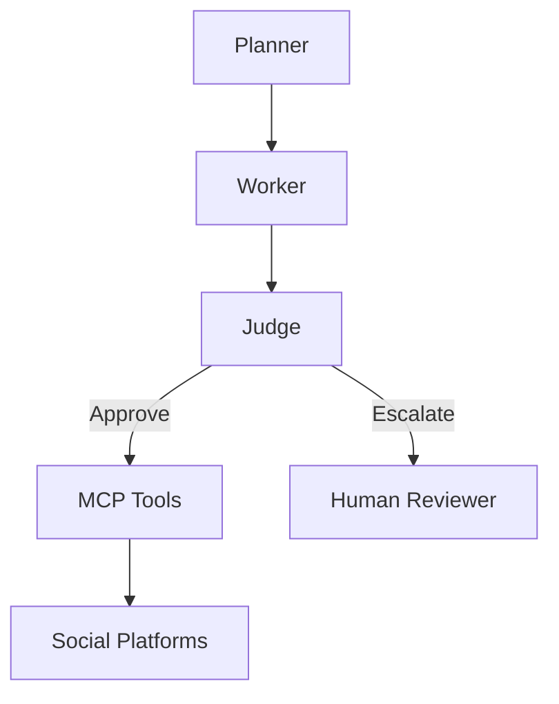

# Architecture Strategy – Project Chimera

## 1. Agent Pattern

Chosen Pattern: Hierarchical Swarm Architecture

Structure:

- Planner Agent
- Worker Agents
- Judge Agents

Reasons:

- Supports massive parallelism
- Easy error isolation
- Built-in quality control
- Matches Chimera SRS

## 2. Human-in-the-Loop (Safety Layer)

Humans review content only when:

- confidence_score < 0.8
- Sensitive topics detected
- High-value payments requested

Flow:
Worker → Judge → Human (if needed)

## 3. Database Strategy

PostgreSQL:

- Users
- Campaigns
- Transactions

NoSQL (MongoDB/DynamoDB):

- Video metadata
- Media generation logs

Weaviate:

- Agent memories

Redis:

- Queues
- Short-term memory

## 4. High-Level Architecture Diagram

