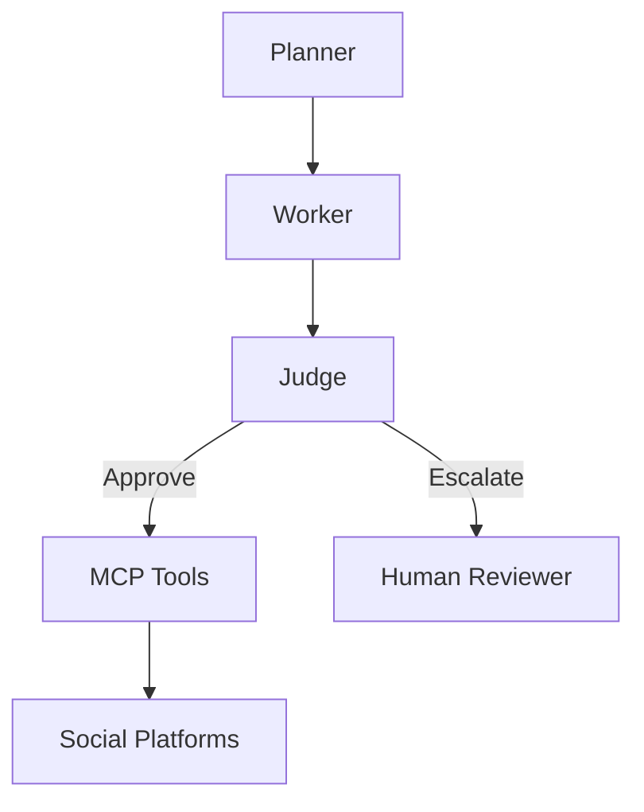

# Architecture Strategy – Project Chimera

## Agent Pattern

Chosen Pattern: Hierarchical Swarm

Agents:

- Planner
- Worker
- Judge

Reason:
Supports scalability, parallel work, and quality control.

---

## Human-in-the-Loop (Safety Layer)

Humans review only risky outputs.

Triggers:

- Confidence < 0.8
- Sensitive topics
- High payments

Flow:
Worker → Judge → Human

---

## Database Strategy

PostgreSQL:

- Users
- Campaigns
- Transactions

NoSQL (MongoDB/DynamoDB):

- Video metadata

Weaviate:

- Agent memory

Redis:

- Cache and queues

---

## Architecture Diagram

